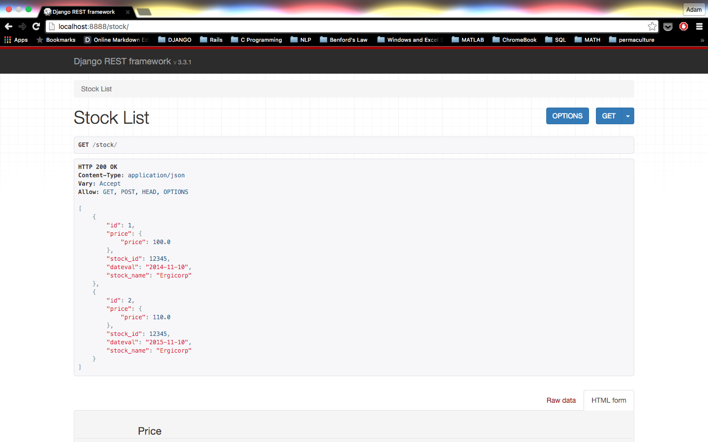

# Introduction
The goal of this repo is to provide a completely self-contained example of how
to use the Django model field ForeignObject. For motivation, and more a more detailed
tutorial, please see [my blog post about ForeignObject][1]

Since the goal of this tutorial is to be self-contained and accurate,
please contact me if you find any errors or omissions!

# Setup
This example requires:
  - Python 2.7
  - Django 1.8
  - Django-REST-Framework
  - Postgres 9.3
  - psycopg2

If your system satisfies these requirements, this example should run fine.

If you don't have these dependencies installed and you don't feel like installing
manually, there is a `Vagrantfile` that has all of the required dependencies.
As long as you have Vagrant and Virtualbox installed it should be very simple to run this application:
  - `cd` into the `DjangoForeignObjectExample` directory
  - `vagrant up` (this will take a few minutes)
  - `vagrant ssh` (this will ssh you into the vagrant VM)
  - `cd app/foreignobject`
  - `python manage.py runserver 0.0.0.0:8000`

The application will now be running on port 8000 of the VM, which is forwarded
to port 8888 on your host machine.


# Create the App
First, create your django project & create an app within the project:
  - `django-admin startproject foreignobject`
  - `cd foreignobject`
  - `python manage.py startapp app`

Make sure to add 'app' and 'rest_framework' to your installed apps in your settings module.
Also update the database information. The database name, user, and password below are the
setup for the Vagrantfile. If you're using your own setup substitute the correct info
into those fields.
```python
# foreignobject/foreignobject/settings.py
...
INSTALLED_APPS = (
    'django.contrib.admin',
    'django.contrib.auth',
    'django.contrib.contenttypes',
    'django.contrib.sessions',
    'django.contrib.messages',
    'django.contrib.staticfiles',
    'rest_framework',
    'app',
)
...
DATABASES = {
    'default': {
        'ENGINE': 'django.db.backends.postgresql_psycopg2',
        'NAME': 'foreignobject',
        'USER': 'foreignobject',
        'PASSWORD': 'foreignobject',
        'HOST': 'localhost',
    }
}
```

# Models
Now let's create our models.

```python
# foreignobject/app/models.py

from django.db import models

class ForeignObject(models.fields.related.ForeignObject):
    requires_unique_target = False

class Stock(models.Model):
    stock_id = models.IntegerField()
    dateval = models.DateField()
    stock_name = models.CharField(max_length=255)

    price = ForeignObject('Price',
                          from_fields=('stock_id','dateval',),
                          to_fields=('stock_id','dateval',),
                          related_name='stock_list',
                          unique=True)

    class Meta:
        unique_together = (('stock_id', 'dateval', ),)

class Price(models.Model):
    stock_id = models.IntegerField()
    dateval = models.DateField()
    price = models.FloatField()

    stock = ForeignObject('Stock',
                          from_fields=('stock_id','dateval',),
                          to_fields=('stock_id','dateval',),
                          related_name='price_list',
                          unique=True)

    class Meta:
        unique_together = (('stock_id', 'dateval', ),)
```

Then run `python manage.py makemigrations` and then `python manage.py migrate`.

# Play Around with the Models
Now we can open a Django shell using `python manage.py shell`
and create some data to see that this works.
```
>>> from app.models import *
>>> stock_name = 'Ergicorp'
>>> stock_id = 12345
>>> dateval0 = '2014-11-10'
>>> dateval1 = '2015-11-10'

>>> Stock.objects.create(stock_id=stock_id, dateval=dateval0, stock_name=stock_name)
<Stock: Stock object>

>>> Stock.objects.create(stock_id=stock_id, dateval=dateval1, stock_name=stock_name)
<Stock: Stock object>

>>> map(lambda x: (x.dateval, x.stock_id, x.stock_name), Stock.objects.all())
[(datetime.date(2014, 11, 10), 12345, u'Ergicorp'), (datetime.date(2015, 11, 10), 12345, u'Ergicorp')]

>>> Price.objects.create(stock_id=stock_id, dateval=dateval0, price=100.0)
<Price: Price object>

>>> Price.objects.create(stock_id=stock_id, dateval=dateval1, price=110.0)
<Price: Price object>

>>> map(lambda x: (x.dateval, x.stock_id, x.price), Price.objects.all())
[(datetime.date(2014, 11, 10), 12345, 100.0), (datetime.date(2015, 11, 10), 12345, 110.0)]

>>> stock = Stock.objects.get(stock_id=12345, dateval='2015-11-10')
>>> stock.price.price
110.0

>>> price = Price.objects.get(stock_id=12345, dateval='2015-11-10')
>>> price.stock.stock_name
u'Ergicorp'
```
Cool! Things are working and we've got some ForeignObject multi-column join goodness going on.

# Integrate with Django-REST-Framework
In order to create an API end-point using Django-REST-Framework, first let's
create our serializers.

```python
# foreignobject/app/serializers.py

from app import models as app_models
from rest_framework.serializers import ModelSerializer

class PriceSerializer(ModelSerializer):
    class Meta:
        model = app_models.Price
        fields = ('price',)

class StockSerializer(ModelSerializer):
    price = PriceSerializer(many=False)

    class Meta:
        model = app_models.Stock

    def create(self, validated_data):
        price_data = validated_data.pop('price')
        stock = app_models.Stock.objects.create(**validated_data)
        app_models.Price.objects.create(stock=stock, **price_data)
        return stock
```

Then we create our views.

```python
# foreignobject/app/views.py

from app import models as app_models
from app import serializers as app_serializers
from rest_framework import generics

class StockListView(generics.ListCreateAPIView):
    serializer_class = app_serializers.StockSerializer
    queryset = app_models.Stock.objects.all()
```

Finally, we add our url end-points.

```python
# foreignobject/foreignobject/urls.py

from django.conf.urls import include, url
from django.contrib import admin

from app import urls as app_urls

urlpatterns = [
    url(r'^', include(app_urls)),
]
```

```python
# foreignobject/app/urls.py

from django.conf.urls import url
from app import views as app_views

urlpatterns = [
    url(r'^stock/$', app_views.StockListView.as_view()),
]
```

And now we can see the results of our hard work!



[1] http://aergener.github.io/#/blog/foreign_object.html
